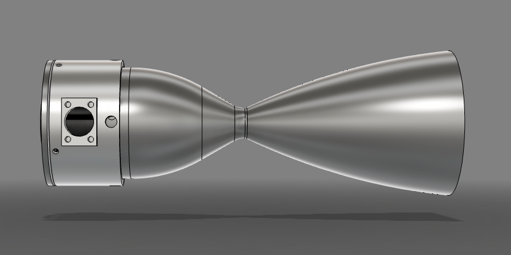
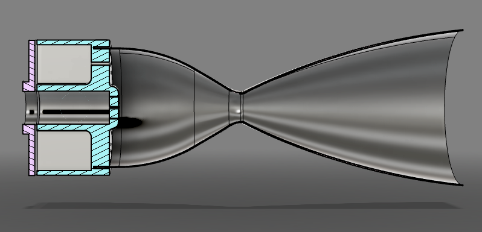
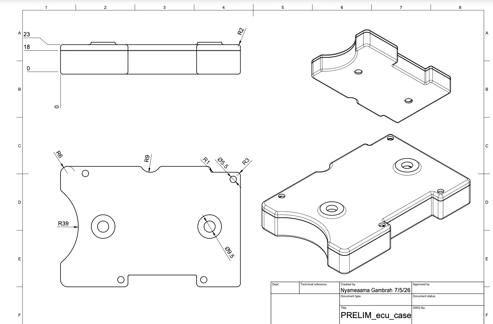

# Central ECU Design

The project builds on the [Converse Engine](https://github.com/nyameaama/Converse-Engine) design. The goal is to bring the engine-side electronics into one package: valve and ignition control, pressure and temperature sensing, power management, safety, and CAN communication with other vehicle zones.

## Engine Design

| Exterior view                                                       | Section view                                                       |
| ------------------------------------------------------------------- | ------------------------------------------------------------------ |
|  |  |

## Design Story

The Converse Engine is pressure-fed, so tank pressurization and upstream propellant control are handled by the tank zone. This ECU handles the hardware mounted on the engine itself. It receives commands from the vehicle and tank-zone controllers over CAN / CAN FD, runs the local engine sequence, reads the sensors, and reports status and faults.

I have split the design into four main areas:

1. **Vehicle interface** — 48 V input power, CAN / CAN FD, arm/safe, abort, and service interlocks.
2. **Engine control** — ignition, valve timing, purge, shutdown, safing, and fault handling.
3. **Power and I/O** — valve drivers, sensor inputs, ignition power, rail monitoring, and the backup battery.
4. **Packaging** — the enclosure, PCB shape, connectors, cooling, vibration support, sealing, and service access.

With the first enclosure drawing complete, there is now a real mechanical boundary for the board instead of an open-ended schematic. That drawing will be the starting point for the PCB outline and component placement in Altium.

## Preliminary ECU Packaging

This is the first pass at the ECU enclosure. The dimensions and feature locations are still preliminary and will change as the connectors, PCB, battery mounting, and engine mounting points are worked out together.

### CAD-Derived Packaging Assumptions

- The enclosure is shallow, asymmetric, and intended to mount directly to the engine structure.
- The current side view shows an 18 mm main body height and a 23 mm maximum height.
- The top edge uses a nominal R2 radius.
- The large R39 cutout needs to stay clear in both the PCB outline and component placement.
- The remaining outline uses R6 corners with local R9, R7, and R3 transitions around the smaller cutouts.
- The two center Ø9.5 mm holes mount the enclosure directly to the engine.
- The Ø5.5 mm holes around the edge mount the internal ECU/PCB assembly to the enclosure.
- Fastener selection, tolerances, vibration locking, and any electrical bonding through these mounting points still need to be finalized.
- The perimeter cutouts and raised walls will determine the final PCB shape, connector locations, and cable exits.
- The lid and base will need a continuous seal around the fasteners and connector openings.
- The PCB and 3S 18650 pack need proper mechanical support for engine vibration and shock.
- The battery pack will have its own section within the ECU assembly, with electrical insulation, temperature monitoring, and a vent path away from the main electronics and propellant hardware.
- Connectors should remain accessible with the ECU installed on the engine.

## Technical Requirements

### Rocket Engine ECU — Engine Mounted

The ECU will be mounted directly on the engine and will control only local engine-mounted devices. It must acquire engine telemetry, enforce local inhibits, report faults, and exchange commands and status with the tank zone and vehicle controller.

### Power

- Input power from external 48 V bus
- Internal 12 V valve rail
- Internal 5 V sensor rail
- Internal 3.3 V logic rail
- Integrated 3S 18650 reserve / backup battery pack
- Onboard 3S lithium-ion backup battery charger powered from the external 48 V bus
- Per-cell voltage monitoring, balancing, overcharge, over-discharge, overcurrent, and short-circuit protection
- Backup battery temperature sensing and charge inhibit outside the permitted temperature range
- Automatic, interruption-free switchover between the external bus and backup battery
- Backup battery isolation / service disconnect
- Backup battery state-of-charge and fault telemetry
- Valve power cutoff / inhibit
- Voltage and current sensing for local ECU rails
- Protected output power to local engine-mounted devices only

### Valves

- MFV: Main Fuel Valve
- MOV: Main Oxidizer Valve
- Fuel Inlet Isolation Valve
- Oxidizer Inlet Isolation Valve
- FPV: Fuel-Side Purge Valve
- OPV: Oxidizer-Side Purge Valve
- CPV: Chamber / Injector Purge Valve
- Oxidizer Bleed / Chilldown Valve
- FBV: Fuel Bleed Valve
- IFV: Igniter Fuel Valve
- IOV: Igniter Oxidizer Valve
- IPV: Igniter Purge Valve
- FDV: Fuel Manifold Dump Valve
- ODV: Oxidizer Manifold Dump Valve

### Valve Driver Interface

- Solenoid driver circuits
- Per-channel voltage sensing
- Per-channel current sensing
- Open-load detection
- Short-circuit detection
- Flyback / inductive clamp protection
- Global valve power cutoff
- Valve rail overvoltage / undervoltage protection

### Pressure Transducer Inputs

- Main fuel inlet pressure
- Main oxidizer inlet pressure
- Fuel manifold pressure
- Oxidizer manifold pressure
- Chamber pressure
- Igniter fuel pressure
- Igniter oxidizer pressure
- Purge pressure

### Temperature Inputs

- Chamber wall thermistors / thermocouples
- Injector temperature
- Fuel inlet temperature
- Oxidizer inlet temperature
- Valve body temperatures
- ECU board temperature
- Valve driver temperature
- Cooling jacket inlet/outlet temperature

### Ignition

- Igniter power driver -> electrical igniter
- Igniter current sensing
- Igniter voltage sensing
- Igniter enable/inhibit circuit

### Engine Local Safety Inputs

- Engine arm/safe input
- Local abort / inhibit input
- Valve power enable feedback
- Igniter enable feedback
- Service connector interlock

### Zone Communications

- CAN / CAN FD controller
- CAN transceiver
- Tank zone command interface
- Tank zone telemetry interface
- Vehicle controller command interface
- Heartbeat monitoring
- CAN timeout detection
- Fault reporting
