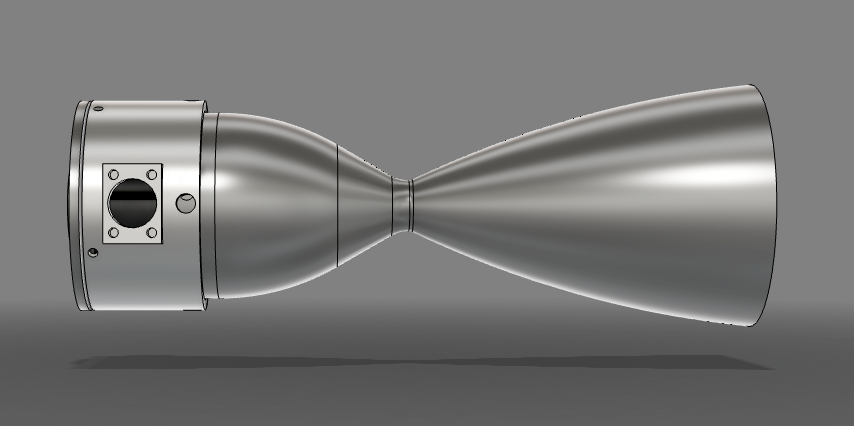
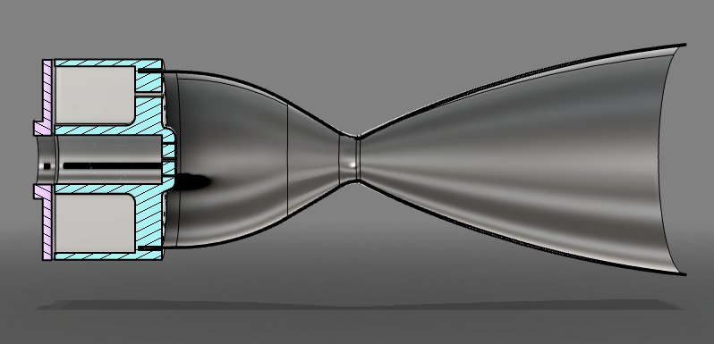
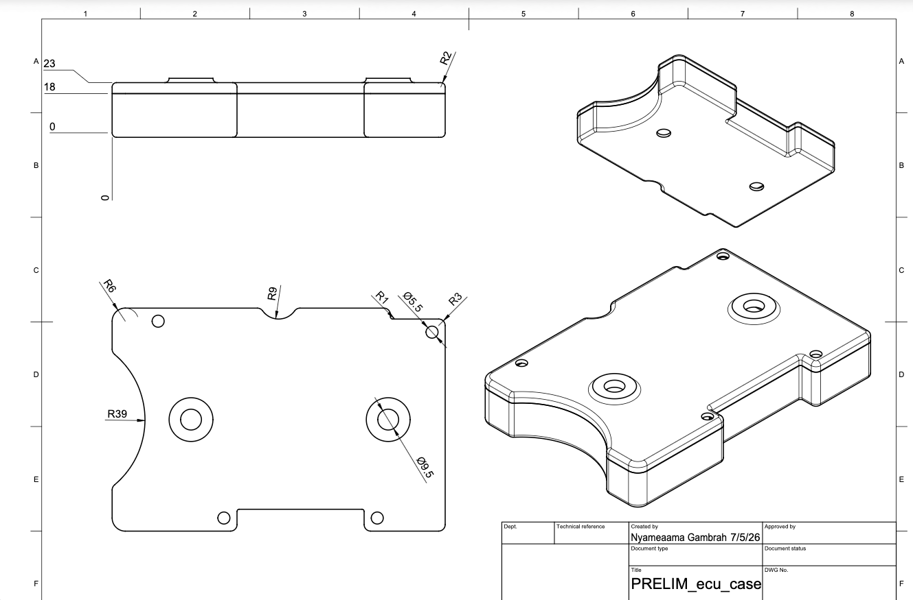

# Central ECU

ECU for the [Converse Engine](https://github.com/nyameaama/Converse-Engine). This box handles the electronics mounted on the engine. Tank pressure and tank-side hardware stay with the tank controller.

The ECU runs the local engine sequence, drives the valves and igniter, reads the sensors, and talks to the rest of the vehicle over CAN FD.

| Engine | Section view |
| --- | --- |
|  |  |

## Current enclosure

This is the first enclosure pass. I am using it to get a real PCB outline and start placing connectors. Dimensions will move as the board and battery mounts develop.

Current CAD notes:

- 18 mm main body height
- 23 mm max height
- R2 top edge
- keep the R39 cutout clear on the PCB
- R6 outer corners with the smaller R9, R7, and R3 transitions shown in CAD
- two 9.5 mm holes mount the enclosure to the engine
- 5.5 mm perimeter holes mount the PCB assembly
- battery needs its own clamp, insulation, covered terminals, and service access
- connectors need to stay reachable with the ECU installed
- lid and connector openings need a continuous seal

## Power

- 28 V nominal aircraft bus
- regulated 24 V valve rail
- 12 V ignition and sensor rails
- 5 V analog and communications rail
- 3.3 V logic rail
- EnerSys CYCLON `0819-0020` 12 V, 2.5 Ah pure-lead AGM backup battery

The backup battery only runs the controller, CAN, and sensor measurement electronics. It does not run the valves or igniter. Loss of valve power closes the normally closed valves.

Battery support needs a fuse, disconnect, automatic switchover, voltage and current measurement, temperature measurement, and low voltage cutoff. Charge it only while the engine is safe.

## Valves

- MFV, main fuel
- MOV, main oxidizer
- FPV, fuel purge
- OPV, oxidizer purge
- CPV, chamber and injector purge
- IFV, igniter fuel
- IOV, igniter oxidizer
- IPV, igniter purge

Each valve has its own `TPS26633PWPR` high-side eFuse. `SHDN` is the valve command, so low removes coil power and the normally closed valve returns closed. The eFuse supplies current monitoring and fault status. Each channel also has output-voltage sensing, an inductive clamp, and the common hardware inhibit.

The three igniter valves stay as solenoids for this pass. A custom three-phase igniter actuator would need a different power stage and is not part of the current ECU channel design.

## Pressure

- main fuel inlet
- main oxidizer inlet
- fuel manifold
- oxidizer manifold
- chamber
- igniter fuel
- igniter oxidizer
- purge

## Temperature

- chamber wall
- injector
- fuel inlet
- oxidizer inlet
- valve inlet and outlet fluid temperature where needed
- ECU board
- valve drivers
- cooling jacket inlet and outlet

ECU board and valve driver temperature are PCB measurements. The rest come in through the engine harness.

## Ignition

- igniter power switch
- current and voltage measurement
- hardware enable and inhibit

## Safety inputs

- arm and safe
- abort and inhibit
- valve power feedback
- igniter enable feedback
- service connector interlock

## Communications

- CAN FD
- tank controller commands and telemetry
- vehicle controller commands
- heartbeat and timeout handling
- fault reporting

Parts, interfaces, and the power budget are in [Systems Eng](Systems%20Eng/README.md).
